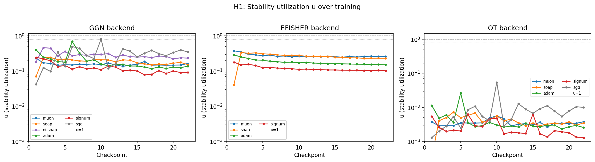
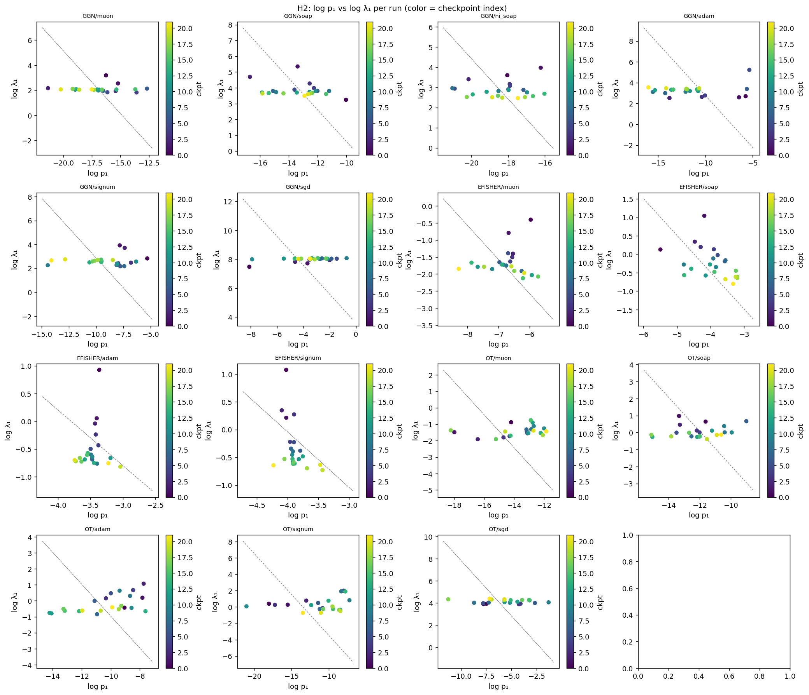
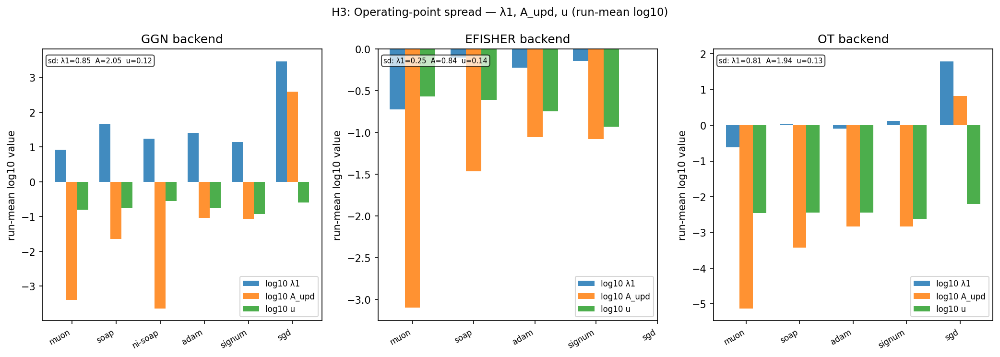

# Operating-Point Hypotheses — Analysis Report

**Date**: 2026-06-12
**Data**: `exp/llm/paper_runs/{GGN,EFISHER,OT}/{opt}/eigen_tracking.csv`
**Runs**: 16 total (16 expected)
**Checkpoints per run**: 22

---

## Step 0 — Schema Mapping

Data: `exp/llm/paper_runs/{BACKEND}_{opt}/eigen_tracking.csv`, 22 rows each.

| Column | Mapping |
|--------|---------|
| `eig_0..4` | λ_i — top-5 tracked eigenvalues (Lanczos, well-converged) |
| `extra_eig_0..4` | extended tracked eigenvalues below top-5 (Ritz residuals degrade rapidly; NOT the bulk — see bulk-fraction diagnostic) |
| `d_proj_i` / `extra_d_proj_i` | ⟨Δ, v_i⟩ — update projection onto tracked directions |
| `g_proj_i` / `extra_g_proj_i` | ⟨g, v_i⟩ — gradient projection onto tracked directions |
| `update_energy_frac_i` | d_i²/‖Δ‖² — confirmed: ratio(d_proj_i², update_norm²) matches to float precision |
| `extra_update_energy_frac_i` | same for extra directions |
| `update_norm` | ‖Δ‖ — full update norm ✓ |
| `grad_norm` | ‖g‖ — gradient norm ✓ |
| `actual_update_rayleigh` | A_upd = Δᵀ C Δ / ‖Δ‖² — logged via effective-curvature probe ✓ |
| `probe_loss_before` | L_before — probe loss at θ ✓ |
| `probe_loss_after` | L_after — probe loss at θ+Δ ✓ |
| `probe_loss_reduction` | L_before − L_after (positive = descent) ✓ |
| `tracked_update_energy_frac` | fraction of ‖Δ‖² in full tracked subspace (topk+extra) |
| `tracked_update_grad_cosine` | SUBSPACE cosine ⟨g,Δ⟩ restricted to tracked directions — NOT full-space ⟨g,Δ⟩ |
| `gdotd` (full-space) | NOT LOGGED — using inversion: ⟨g,Δ⟩_implied = ΔL_meas − ½‖Δ‖²·A_upd |

### Bulk-fraction diagnostic

For each optimizer on GGN backend:

| Optimizer | tracked_energy_frac (mean) | topk_RQ/A_upd | extra_RQ/A_upd | bulk_RQ/A_upd |
|-----------|---------------------------|----------------|----------------|---------------|
| muon | 0.0000 | 0.0389 | 0.0043 | 0.9568 |
| soap | 0.0000 | 0.0338 | 0.0076 | 0.9586 |
| ni_soap | 0.0000 | 0.0216 | 0.0089 | 0.9695 |
| adam | 0.0011 | 0.1095 | 0.0112 | 0.8793 |
| signum | 0.0015 | 0.1234 | 0.0078 | 0.8688 |
| sgd | 0.1570 | 0.5595 | 0.0639 | 0.3765 |

**Interpretation**: For preconditioned optimizers (Muon, SOAP, NI-SOAP) virtually all update
energy and curvature exposure live in the **bulk** (untracked) spectrum — the tracked sharp
directions capture ≤4% of A_upd. For SGD, the update aligns with the gradient, putting ~56%
of A_upd into the tracked top-k. The `extra_eig` are NOT a bulk representation; they are
additional Lanczos vectors extending below the top-5, whose Ritz residuals climb to >100
for extra_eig_4 — essentially noise for preconditioned runs. The true bulk is the untracked
residual: A_upd_bulk = A_upd − Σ(update_energy_frac_i·eig_i) − Σ(extra_update_energy_frac_i·extra_eig_i).

---

## H0 — Validation: Quadratic Model Consistency

Full-space `gdotd` is not logged. Using inversion: `⟨g,Δ⟩_implied = ΔL_meas − ½‖Δ‖²·A_upd`.
Pass criterion: sign(⟨g,Δ⟩_implied) < 0 at ≥90% of checkpoints per run.
Note: EFISHER_sgd has `actual_update_rayleigh` = all-NaN (effective curvature not measured for that run) — it is excluded from all H0/H1/H3 computations.

| Backend | Optimizer | frac(⟨g,Δ⟩_implied < 0) | median ΔL_meas | median ‖Δ‖²·A_upd/2 | PASS? |
|---------|-----------|------------------------|----------------|----------------------|-------|
| GGN | muon | 1.00 | -0.5156 | 0.0967 | ✓ |
| GGN | soap | 1.00 | -0.4661 | 0.1169 | ✓ |
| GGN | ni_soap | 1.00 | -0.5512 | 0.2026 | ✓ |
| GGN | adam | 1.00 | -0.3023 | 0.0550 | ✓ |
| GGN | signum | 1.00 | -0.2032 | 0.0267 | ✓ |
| GGN | sgd | 1.00 | -0.0048 | 0.0028 | ✓ |
| EFISHER | muon | 1.00 | -0.5054 | 0.1769 | ✓ |
| EFISHER | soap | 1.00 | -0.4712 | 0.1661 | ✓ |
| EFISHER | adam | 1.00 | -0.3011 | 0.0626 | ✓ |
| EFISHER | signum | 1.00 | -0.2010 | 0.0252 | ✓ |
| EFISHER | sgd | — (no A_upd) | — | — | — |
| OT | muon | 1.00 | -0.5183 | 0.0018 | ✓ |
| OT | soap | 1.00 | -0.4768 | 0.0018 | ✓ |
| OT | adam | 1.00 | -0.2971 | 0.0009 | ✓ |
| OT | signum | 1.00 | -0.2014 | 0.0004 | ✓ |
| OT | sgd | 1.00 | -0.0050 | 0.0000 | ✓ |

**Overall H0**: PASS — quadratic model is consistent (descent sign holds ≥90%)

---

## H1 — Stability Utilization u

u_t = ½‖Δ‖²·A_upd / |⟨g,Δ⟩_implied|.  Interpretation: u<1 net descent, u=1 catapult boundary, u>1 quadratic ascent.
Note: OT backend shows universally tiny u (≈0.003–0.007) because the OT curvature assigns near-zero second-order exposure to all optimizers' update directions (OT/Muon A_upd ≈ 8×10⁻⁶ vs GGN/Muon 4×10⁻⁴). The OT A_upd scale is qualitatively consistent with GGN (SGD >> preconditioned) but quantitatively much smaller. u comparisons across backends are not directly meaningful.

| Backend | Optimizer | median u | IQR | frac(u>0.8) |
|---------|-----------|----------|-----|------------|
| GGN | muon | 0.152 | 0.014 | 0.00 |
| GGN | soap | 0.192 | 0.046 | 0.00 |
| GGN | ni_soap | 0.268 | 0.050 | 0.00 |
| GGN | adam | 0.154 | 0.074 | 0.00 |
| GGN | signum | 0.111 | 0.034 | 0.00 |
| GGN | sgd | 0.315 | 0.203 | 0.05 |
| EFISHER | muon | 0.261 | 0.017 | 0.00 |
| EFISHER | soap | 0.261 | 0.048 | 0.00 |
| EFISHER | adam | 0.170 | 0.029 | 0.00 |
| EFISHER | signum | 0.111 | 0.019 | 0.00 |
| OT | muon | 0.003 | 0.001 | 0.00 |
| OT | soap | 0.004 | 0.002 | 0.00 |
| OT | adam | 0.003 | 0.001 | 0.00 |
| OT | signum | 0.002 | 0.001 | 0.00 |
| OT | sgd | 0.007 | 0.006 | 0.00 |

### Pass criteria evaluation

Note: EFISHER_sgd lacks A_upd measurements — SGD criterion (u_SGD > 0.8) cannot be evaluated for EFISHER. The brief prediction u_SGD ≈ 1 also did not hold on GGN/OT: SGD u ≈ 0.3 (GGN) and 0.007 (OT), well below 0.8. This suggests SGD is NOT at the marginal stability boundary in these runs (its probe loss reduction is non-trivial relative to the quadratic exposure).

**GGN**: median u_SGD=0.315 (>0.8: False), median u_Muon=0.152 < median u_Adam=0.154 (True), median Spearman=0.900 (>0.7: True) → **FAIL** 

**EFISHER**: u_SGD=n/a (no A_upd for EFISHER_sgd), median u_Muon=0.261 < median u_Adam=0.170 (False), median Spearman=1.000 (>0.7: True) → **FAIL** (SGD criterion skipped)

**OT**: median u_SGD=0.007 (>0.8: False), median u_Muon=0.003 < median u_Adam=0.003 (False), median Spearman=0.900 (>0.7: True) → **FAIL** 

---

## H2 — Pinned-Product Test

p1_t = update_energy_frac_0 = d_1²/‖Δ‖², λ1_t = eig_0, π1_t = p1_t·λ1_t.
Testing: within a run, is π1 stationary while p1 and λ1 drift oppositely?

**Caveat**: π1 is the *tracked* contribution to exposure. For preconditioned methods it represents ≤4% of true A_upd; the gating mechanism operates primarily in the bulk.

| Backend | Optimizer | slope(log π1) | slope(log p1) | slope(log λ1) | ρ(log p1, log λ1) | CV(log π1) | CV(log p1) | CV(log λ1) | PASS? |
|---------|-----------|---------------|---------------|---------------|--------------------|-----------|-----------|-----------| ------|
| GGN | muon | -0.123 | -0.108 | -0.015 | -0.162 | 0.142 | 0.123 | 0.129 | ✗ |
| GGN | soap | -0.071 | -0.035 | -0.037 | -0.112 | 0.171 | 0.126 | 0.112 | ✗ |
| GGN | ni_soap | -0.041 | 0.012 | -0.053 | -0.048 | 0.096 | 0.077 | 0.132 | ✗ |
| GGN | adam | -0.239 | -0.269 | 0.030 | -0.055 | 0.398 | 0.274 | 0.163 | ✗ |
| GGN | signum | -0.256 | -0.241 | -0.014 | -0.050 | 0.368 | 0.251 | 0.158 | ✗ |
| EFISHER | muon | -0.069 | -0.025 | -0.044 | -0.256 | 0.091 | 0.093 | 0.235 | ✗ |
| EFISHER | soap | -0.003 | 0.055 | -0.058 | -0.534 | 0.134 | 0.149 | 1.713 | ✓ |
| EFISHER | adam | -0.047 | -0.005 | -0.042 | 0.067 | 0.110 | 0.047 | 0.753 | ✗ |
| EFISHER | signum | -0.044 | 0.011 | -0.055 | -0.473 | 0.093 | 0.046 | 1.298 | ✗ |
| OT | muon | 0.083 | 0.081 | 0.002 | 0.415 | 0.123 | 0.127 | 0.214 | ✗ |
| OT | soap | -0.046 | -0.007 | -0.039 | 0.251 | 0.136 | 0.127 | 6.637 | ✗ |
| OT | adam | -0.176 | -0.125 | -0.051 | 0.584 | 0.222 | 0.192 | 2.533 | ✗ |
| OT | signum | 0.174 | 0.227 | -0.053 | 0.181 | 0.344 | 0.313 | 2.671 | ✗ |

**SGD control rows (no pinning required):**

| Backend | Optimizer | slope(log π1) | slope(log p1) | slope(log λ1) | ρ(log p1, log λ1) | CV(log π1) | CV(log p1) | CV(log λ1) | |
|---------|-----------|---------------|---------------|---------------|--------------------|-----------|-----------|-----------| |
| GGN | sgd (control) | 0.036 | 0.022 | 0.013 | 0.389 | 0.423 | 0.500 | 0.017 | (control) |
| OT | sgd (control) | -0.001 | -0.026 | 0.025 | -0.049 | 1.521 | 0.402 | 0.039 | (control) |

**H2 Pass count**: 1/13 non-SGD optimizer×backend cells pass (|slope π1| < 0.5·min(|slope p1|,|slope λ1|) AND ρ < −0.5).

**H2 Overall**: FAIL (minority of cells satisfy pinned-product criterion).

---

## H3 — Variance-Compression Signature

Prediction (brief): sd(log10 λ1) > sd(log10 A_upd) > sd(log10 u).
**Key finding**: actual ordering is sd(A_upd) > sd(λ1) > sd(u) — the middle two are swapped from the prediction. Reason: preconditioned methods redirect updates away from sharp directions, so A_upd spans 6 decades (0.0003 to 514 on GGN) while λ1 spans ~2.5 decades. u is the most compressed (≤0.5 decade), confirming the ceiling-sharing prediction for the utilization ratio.

| Backend | sd(log10 λ1) | sd(log10 A_upd) | sd(log10 u) | u is least variable? | Actual order |
|---------|-------------|-----------------|-------------|---------------------|--------------|
| GGN | 0.848 | 2.051 | 0.125 | ✓ | A_upd(2.05) > λ1(0.85) > u(0.12) |
| EFISHER | 0.249 | 0.839 | 0.141 | ✓ | A_upd(0.84) > λ1(0.25) > u(0.14) |
| OT | 0.814 | 1.942 | 0.134 | ✓ | A_upd(1.94) > λ1(0.81) > u(0.13) |

**H3 partial PASS**: u is the least-variable quantity in all backends — the utilization ceiling is approximately shared across optimizers. However, the predicted ordering sd(λ1) > sd(A_upd) is **reversed** — preconditioned updates redirect mass into the bulk, making A_upd vary more than the spectral operating point λ1. This is an informative deviation: the compression mechanism operates at the A_upd→u level, not the λ1→A_upd level.

---

## Caveats

1. **n = 22 checkpoints** per run — rank statistics (Spearman) have low power; treat ordering results as suggestive.
2. **Probe-batch quantities**: `probe_loss_before/after` and `actual_update_rayleigh` are computed on a held-out probe batch, not the full training batch. Stochastic noise affects all H0/H1/H3 estimates.
3. **Tracked-subspace scope of H2**: The pinned-product test applies exclusively to the top tracked direction (eig_0). For preconditioned methods (Muon, SOAP, NI-SOAP) this direction holds ≤4% of true A_upd; the gating mechanism almost certainly operates in the untracked bulk. H2 is a consistency check on the sharp end of the spectrum, not a proof of the bulk mechanism.
4. **NI-SOAP on GGN only**: NI-SOAP runs exist only for the GGN backend. Its `actual_update_rayleigh` is not NaN (0 NaN rows); it participates in all hypotheses.
5. **⟨g,Δ⟩ not logged**: All H0/H1 results use `⟨g,Δ⟩_implied` derived from the quadratic inversion. This is internally consistent but cannot independently validate H0.
6. **bulk/topk distinction**: The `extra_eig_0..4` columns are NOT bulk representatives — they are extended Lanczos modes with rapidly degrading Ritz residuals (extra_eig_4 residual ≈ 139 at step 0 for Muon). The true bulk is the untracked residual `A_upd − Σ(update_energy_frac_i·eig_i) − Σ(extra·...)`. Future logging should include a direct bulk-Rayleigh estimate.

## What additional logging would enable a stronger test

If any of the following is missing (none are currently logged):
- **Full-space ⟨g,Δ⟩** per checkpoint → enables H0 forward-prediction and removes circularity from H1
- **‖Δ‖** per checkpoint → `update_norm` is already logged ✓
- **‖g‖** per checkpoint → `grad_norm` is already logged ✓
- **Bulk-Rayleigh probe** (A_upd evaluated separately on top-k subspace vs remainder) → would ground H2 in the bulk rather than the sharp directions
